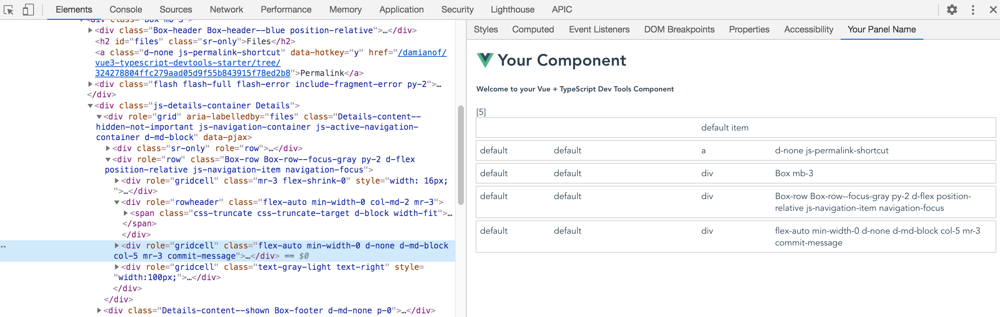

# vue3-typescript-devtools-starter

A starter kit for developing Chrome/Chromium Dev Tools Extensions with Vue and TypeScript



## Project setup
```
npm install
```

### Compiles and minifies for production under dist/ folder
```
npm run build
```

### In Chrome
1) enable Developer mode in the Extensions settings
2) Load unpacked extension and select the dist/ folder
3) Open the Developer Tools, Elements tab, and select Html dom elements in the inspected page. The app will render in the "Your Panel Name" panel

### Customize configuration
See [Configuration Reference](https://cli.vuejs.org/config/).
